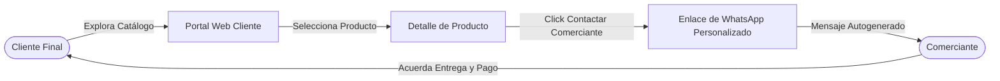
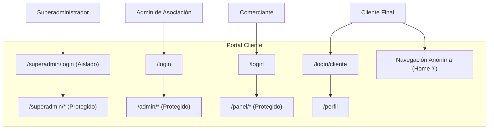
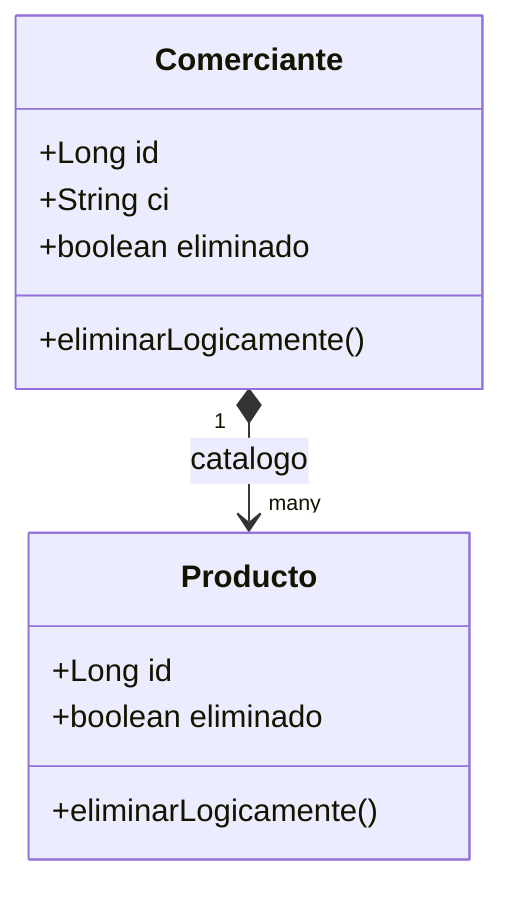

# Documento de Arquitectura de Software (SAD) - Mercado Mutualista Online

Este documento describe la arquitectura de software, las decisiones de diseño y las pautas técnicas de la plataforma **Mercado Mutualista Online** tras alcanzar el hito **RC1**. La estructura sigue un enfoque de diseño orientado a objetos con la filosofía de Craig Larman.

---

## 1. Visión General del Sistema

### Descripción del Problema de Negocio y Solución Tecnológica
En el contexto tradicional de los mercados populares y mutualistas, los intermediarios suelen aumentar los costos de comercialización y diluir los márgenes de ganancia de los pequeños productores y comerciantes. A su vez, los clientes finales carecen de un canal digital unificado y ágil para explorar la oferta local del mercado antes de realizar una compra.

**Mercado Mutualista Online** aborda esta problemática mediante una plataforma web auto-gestionada por las asociaciones de comerciantes. La solución se basa en:
*   **Catálogo Digital Sin Comisiones:** Una vitrina interactiva donde los comerciantes registrados exponen sus productos con información detallada, precios y fotografías. Las transacciones están libres de comisiones por intermediación de la plataforma.
*   **Redirección Directa a WhatsApp:** El sistema no procesa pagos en línea (reduciendo la fricción tecnológica, costos financieros y necesidades de cumplimiento legal). En su lugar, el flujo de compra culmina redirigiendo al cliente directamente a una conversación de WhatsApp con el comerciante específico, inyectando un mensaje pre-configurado que detalla los productos de interés para concretar la entrega y el pago de manera directa (Peer-to-Peer / B2C).



### Modelo de Ingresos y Sostenibilidad
El modelo operativo de la plataforma asegura su sustentabilidad a largo plazo sin necesidad de extraer comisiones de las ventas:
1.  **Cuota Social de la Asociación:** El sistema está administrado a nivel intermedio por la Asociación de Comerciantes. La Asociación cobra una cuota de mantenimiento fija a los comerciantes para habilitar su espacio en el catálogo virtual.
2.  **Cobranza y Control Local:** El sistema permite a los Administradores de la Asociación suspender o dar de baja de forma lógica a comerciantes que no estén al día con su cuota social, ocultando temporalmente sus productos del público general sin eliminar sus datos de catálogo ni su multimedia.

---

## 2. Stack Tecnológico y Despliegue

La plataforma se despliega como una arquitectura desacoplada y moderna para web, estructurada en un backend API REST y un cliente enriquecido (Single Page Application).

```
┌────────────────────────────────────────────────────────┐
│                        CLIENTE                         │
│   React 19 + TypeScript + Vite + CSS Nativo (Portal)   │
└───────────────────────────┬────────────────────────────┘
                            │ HTTP API (JSON)
                            ▼
┌────────────────────────────────────────────────────────┐
│                        BACKEND                         │
│           Spring Boot 3.5 + Java 21 + JPA              │
└───────────────────────────┬────────────────────────────┘
                            │ JDBC
                            ▼
┌────────────────────────────────────────────────────────┐
│                  PERSISTENCIA Y DATOS                  │
│       H2 Database (Local) / AWS / Huawei Cloud RDS      │
└───────────────────────────┬────────────────────────────┘
```

### Backend
*   **Lenguaje y Runtime:** Java 21 (LTS), aprovechando mejoras de rendimiento y sintaxis moderna.
*   **Framework Principal:** [Spring Boot 3.5.0](file:///home/santiago/Desktop/Mercado/build.gradle#L3) para arranque rápido, configuración auto-gestionada y empaquetado autocontenido.
*   **Persistencia:** Spring Data JPA (Hibernate) para el mapeo objeto-relacional y la abstracción del almacenamiento.
*   **Base de Datos:** [H2 Database](file:///home/santiago/Desktop/Mercado/build.gradle#L28) en modo archivo local (`./data/mercado_db`) para desarrollo, fácilmente configurable a MySQL o PostgreSQL para producción.
*   **Seguridad:** Spring Security con filtros personalizados basados en headers HTTP para autenticación ligera.
*   **Métricas y Diagnóstico:** Spring Boot Actuator expone endpoints de `/health` y `/metrics` para monitorización en tiempo real.

### Frontend
*   **Framework:** [React 19.2.7](file:///home/santiago/Desktop/Mercado/portal-cliente/package.json#L13) para la renderización declarativa de interfaces interactivas de usuario.
*   **Herramienta de Compilación/Empaquetado:** [Vite 8.1.1](file:///home/santiago/Desktop/Mercado/portal-cliente/package.json#L25) como motor de bundling ultrarrápido y Hot Module Replacement (HMR).
*   **Lenguaje:** [TypeScript 6.0.2](file:///home/santiago/Desktop/Mercado/portal-cliente/package.json#L24) aportando tipado estático seguro y previniendo errores en tiempo de diseño.
*   **Enrutamiento:** React Router Dom v7.18.1 para el manejo de rutas protegidas y la navegación dinámica.
*   **Visualización:** Recharts v3.9.2 para gráficos de métricas y visitas en los paneles de control.
*   **Diseño Visual:** CSS Nativo (Vanilla CSS) estructurado bajo un sistema de variables de diseño para máxima flexibilidad, eliminando dependencias pesadas como TailwindCSS y garantizando una carga rápida.

### Infraestructura (Target)
*   **Cómputo:** Instancias ECS (Elastic Cloud Server) de **Huawei Cloud** corriendo entornos Linux contenerizados (Docker).
*   **Storage (Almacenamiento):** La abstracción técnica de almacenamiento (`StorageService`) permite alternar sin impacto en el negocio entre un almacenamiento local (mediante el adaptador de archivos de disco `LocalFileSystemStorageAdapter`) y almacenamiento en la nube en producción.

---

## 3. Actores y Límites del Sistema

El sistema establece límites lógicos y rutas físicas estrictamente segregadas para cada perfil de usuario con el fin de proteger las operaciones de administración.



1.  **Superadministrador (Dueño del Sistema):**
    *   **Responsabilidades:** Configuración de los parámetros maestros de la plataforma. Crea, modifica y suspende las cuentas de los Administradores de Asociación. Gestiona el catálogo maestro de Unidades de Medida de los productos.
    *   **Límites Lógicos/Físicos:** Aislado en la ruta independiente [LoginSuperAdmin.tsx](file:///home/santiago/Desktop/Mercado/portal-cliente/src/presentation/pages/LoginSuperAdmin.tsx) (`/superadmin/login`) y bajo el layout protegido `SuperAdminLayout` (`/superadmin/*`). Su flujo de autenticación no comparte vistas con el login común de comerciantes.
2.  **Administrador de Asociación:**
    *   **Responsabilidades:** Cobranza de cuotas y fiscalización de puestos físicos. Registra y actualiza comerciantes, asignándoles contraseñas seguras. Puede suspender comerciantes (dar de baja lógica) si incumplen los pagos, invisibilizando instantáneamente su mercadería en el catálogo público sin destruir datos relacionales.
    *   **Límites Lógicos/Físicos:** Opera en el portal administrativo (`/admin/*`) a través de [AdminLayout](file:///home/santiago/Desktop/Mercado/portal-cliente/src/App.tsx#L18). Sus credenciales se validan en base de datos bajo el rol `ADMIN`.
3.  **Comerciante:**
    *   **Responsabilidades:** Auto-gestión de su perfil digital (número de puesto, nombre público, teléfono de contacto). Publica y edita los productos de su catálogo (nombre, descripción, precios, imágenes multimedias, categoría y unidades de medida). Monitorea el número de veces que los clientes hacen clic para contactarle por WhatsApp.
    *   **Límites Lógicos/Físicos:** Accede mediante el portal común (`/login`) y gestiona su negocio en la ruta `/panel/*` respaldado por `ComercianteLayout`. Sus APIs correspondientes residen principalmente en `/api/productos` y `/api/portal/comerciantes`.
4.  **Cliente (Consumidor Final):**
    *   **Responsabilidades:** Visualiza y filtra los catálogos de los comerciantes activos de forma anónima. Opcionalmente, puede registrarse e iniciar sesión (`/login/cliente`) para poder interactuar activamente con el sistema, marcando productos como "de interés", agregando reseñas con calificaciones cuantitativas y contactando de forma ágil a los comerciantes vía el redireccionador de WhatsApp.

---

## 4. Arquitectura Lógica (Patrón Layers)

El backend de la aplicación implementa el patrón de arquitectura por capas (Layers Pattern) con el objetivo de separar de forma clara las responsabilidades técnicas del dominio de negocio.

```
┌────────────────────────────────────────────────────────┐
│                   presentation (REST)                  │
│  Recibe solicitudes HTTP, valida entradas, retorna DTOs│
└───────────────────────────┬────────────────────────────┘
                            │ Llama a
                            ▼
┌────────────────────────────────────────────────────────┐
│                   application (Servicios)              │
│ Coordina transacciones, inicialización y normalización │
└───────────────────────────┬────────────────────────────┘
                            │ Manipula
                            ▼
┌────────────────────────────────────────────────────────┐
│                     domain (Core)                      │
│ Contiene Entidades Ricas de Negocio e Interfaces Repo  │
└───────────────────────────┬────────────────────────────┘
                            │ Implementa / Configura
                            ▼
┌────────────────────────────────────────────────────────┐
│                   infrastructure (Tech)                │
│ Configs de Seguridad, Adaptadores de IO, DB y Mensajería│
└────────────────────────────────────────────────────────┘
```

### Capa 1: presentation
*   **Ubicación:** [com.mutualista.mercado.presentation](file:///home/santiago/Desktop/Mercado/src/main/java/com/mutualista/mercado/presentation)
*   **Componentes:** Controladores REST (p. ej. `SuperAdminController`, `AdminComercianteController`, `AuthController`) y objetos de transferencia de datos (DTOs).
*   **Justificación:** Aísla por completo el protocolo HTTP de la lógica de negocio. Ninguna regla o validación de procesos internos debe estar acoplada en esta capa; los controladores se limitan a recibir parámetros, delegar la lógica hacia las capas de aplicación o dominio, y estructurar la respuesta JSON.

### Capa 2: application
*   **Ubicación:** [com.mutualista.mercado.application](file:///home/santiago/Desktop/Mercado/src/main/java/com/mutualista/mercado/application)
*   **Componentes:** Servicios coordinadores globales (`ImageOptimizationService`, `UnidadMedidaNormalizador`) y el semillero de datos iniciales (`DataSeeder`).
*   **Justificación:** Coordina flujos de control técnicos que requieren orquestar múltiples elementos del dominio o componentes externos de infraestructura. No contiene la lógica de negocio directa de las entidades, sino que sirve de puente organizador.

### Capa 3: domain
*   **Ubicación:** [com.mutualista.mercado.domain](file:///home/santiago/Desktop/Mercado/src/main/java/com/mutualista/mercado/domain)
*   **Componentes:** Entidades enriquecidas (p. ej. `Comerciante`, `Producto`, `AdministradorMercado`, `Categoria`) y las firmas conceptuales de los Repositorios (albergadas bajo el paquete `repository` en el mismo nivel lógico).
*   **Justificación:** Implementa el concepto de *Modelo de Dominio Rico* (Domain-Driven Design). Las entidades contienen estado y comportamiento propio de las reglas del negocio de manera inmutable o segura (como el cálculo de portada de imágenes en `Producto`, o la cascada de borrado lógico en `Comerciante`). Los repositorios definen el contrato de persistencia sin acoplarse a tecnologías específicas de base de datos.

### Capa 4: infrastructure
*   **Ubicación:** [com.mutualista.mercado.infrastructure](file:///home/santiago/Desktop/Mercado/src/main/java/com/mutualista/mercado/infrastructure)
*   **Componentes:** Configuraciones del framework (`SecurityConfig`), adaptadores de almacenamiento de archivos (`LocalFileSystemStorageAdapter` que implementa `StorageService`), y el formateador de mensajería (`WhatsAppAdapterImpl`).
*   **Justificación:** Alberga las dependencias concretas de frameworks externos e interfaces de E/S. Permite encapsular las particularidades técnicas de la infraestructura física (disco local, API de mensajería de WhatsApp) bajo abstracciones estables para que el resto del código no se vea modificado al cambiar de proveedor tecnológico.

---

## 5. Decisiones de Diseño y Patrones GRASP Aplicados

### Arranque en Frío (Carga Cero) y Patrón Creator
Para evitar el escenario crítico de bloqueo de acceso de administradores (Lockout) al iniciar el sistema con una base de datos nueva o tras un formateo accidental, se implementó el componente [DataSeeder.java](file:///home/santiago/Desktop/Mercado/src/main/java/com/mutualista/mercado/application/DataSeeder.java).
*   **Funcionamiento:** DataSeeder implementa la interfaz `CommandLineRunner` de Spring, ejecutándose de forma automática en el arranque del servidor.
*   **Aplicación del Patrón Creator:** De acuerdo con Larman, el inicializador tiene los datos necesarios para crear al Superadministrador inicial. Lee de forma segura los valores desde [application.properties](file:///home/santiago/Desktop/Mercado/src/main/resources/application.properties) (`app.superadmin.nombre`, `app.superadmin.ci`, `app.superadmin.expedido` y `app.superadmin.password`).
*   **Resiliencia Antilockout:** DataSeeder no solo crea la cuenta si esta no existe, sino que, si detecta que la cuenta existe pero fue dada de baja de manera lógica (campo `eliminado = true`), invoca de forma automática la función `.reactivar()` del dominio y resincroniza las credenciales con los valores de las propiedades locales.

```java
// DataSeeder.java - Resiliencia Antilockout
Optional<AdministradorMercado> existingOpt = adminRepo.findByCi(superadminCi);
if (existingOpt.isPresent()) {
    AdministradorMercado existing = existingOpt.get();
    if (existing.isEliminado()) {
        existing.reactivar();
        existing.actualizarDatos(superadminNombre, superadminPassword, existing.getTelefono());
        adminRepo.save(existing);
    }
}
```

### Fabricación Pura (Pure Fabrication) en UI
La creación de formularios de ingreso y registro seguros para múltiples actores requiere un comportamiento uniforme y altamente cohesionado de campos para contraseñas de seguridad.
*   **Solución:** Se diseñó el componente independiente [PasswordInput.tsx](file:///home/santiago/Desktop/Mercado/portal-cliente/src/presentation/components/PasswordInput.tsx).
*   **Aplicación del Patrón:** Este componente es una *Fabricación Pura*. No representa una entidad real del negocio, sino que es un artefacto puramente técnico creado en el frontend para evitar que la compleja lógica interactiva de enmascaramiento de contraseñas y el uso de iconos SVG de visibilidad se duplique y acople en las múltiples pantallas de inicio de sesión (`LoginCliente.tsx`, `LoginComerciante.tsx`, `LoginSuperAdmin.tsx`, `RegistroCliente.tsx`).

### Variaciones Protegidas (Protected Variations) mediante "Baja Lógica"
Cuando un comerciante incumple con el pago de sus cuotas de asociación o sufre una sanción administrativa local, es mandatorio ocultar su catálogo e impedir que los clientes finales inicien contactos comerciales con él.
*   **Solución:** Se implementó una estrategia de **Baja Lógica** (Soft Delete) en cascada.
*   **Aplicación del Patrón:** El sistema protege los datos del comerciante y de los productos (incluyendo las imágenes y enlaces multimedia almacenados físicamente) contra una eliminación destructiva. Al invocar [eliminarLogicamente()](file:///home/santiago/Desktop/Mercado/src/main/java/com/mutualista/mercado/domain/Comerciante.java#L73) en el comerciante, el dominio propaga en cascada el estado `eliminado = true` a todo su catálogo de productos.
*   **Beneficios:** Protege las estadísticas de visitas y clics de contacto anteriores frente a la pérdida de registros en cascada en la base de datos y evita costosas operaciones físicas de borrado de almacenamiento en disco/nube. Si el comerciante salda su deuda, el Administrador reactiva la cuenta y todo el catálogo vuelve a estar visible de forma instantánea sin pérdida de información histórica.



### Bajo Acoplamiento en Autenticación
Históricamente, los comerciantes accedían utilizando un sistema simple de "PIN de 4 dígitos", lo cual era altamente inseguro y limitaba la escalabilidad del sistema de control.
*   **Solución:** Migración completa a un sistema de credenciales estandarizado y seguro.
*   **Aplicación del Patrón:** En el backend, las clases del dominio manejan la propiedad de contraseña como una cadena abstracta compleja y la infraestructura de seguridad valida estas credenciales mediante filtros desacoplados como [SimpleHeaderAuthFilter.java](file:///home/santiago/Desktop/Mercado/src/main/java/com/mutualista/mercado/infrastructure/security/SimpleHeaderAuthFilter.java). El flujo del cliente se independiza del almacenamiento de la contraseña en texto plano, delegando la responsabilidad de autenticación de forma segura a través de encabezados customizados (`X-User-Id`), logrando un bajo acoplamiento entre la lógica comercial y los mecanismos de sesión.

---

## 6. Guía de Instalación y Arranque Local

### Requisitos del Entorno
*   **Java SE Development Kit (JDK):** Versión 21 instalada y configurada en la variable de entorno `JAVA_HOME`.
*   **Node.js:** Versión 18.0 o superior (se recomienda la última versión LTS).
*   **npm:** Versión 9.0 o superior.

### Configuración e Inicio del Backend (Spring Boot)
1.  Abra una terminal en la raíz del proyecto.
2.  Compile y ejecute el servidor en modo desarrollo utilizando el Gradle Wrapper:
    ```bash
    # En Linux / macOS
    chmod +x gradlew
    ./gradlew bootRun

    # En Windows (CMD o PowerShell)
    gradlew.bat bootRun
    ```
3.  El servidor de Spring Boot se iniciará en el puerto **`8080`**.
4.  Puede acceder a la consola del motor de base de datos H2 en: [http://localhost:8080/h2-console](http://localhost:8080/h2-console) con los siguientes parámetros:
    *   **JDBC URL:** `jdbc:h2:file:./data/mercado_db`
    *   **User Name:** `sa`
    *   **Password:** *(dejar vacío)*

### Configuración e Inicio del Frontend (React + Vite)
1.  Abra una terminal secundaria e ingrese al subdirectorio del cliente:
    ```bash
    cd portal-cliente
    ```
2.  Instale las dependencias de desarrollo y producción especificadas en el archivo `package.json`:
    ```bash
    npm install
    ```
3.  Inicie el servidor de desarrollo de Vite:
    ```bash
    npm run dev
    ```
4.  Abra su navegador web y acceda a: [http://localhost:5173](http://localhost:5173)

### Credenciales por Defecto del Entorno de Desarrollo
Al levantar el sistema por primera vez, el `DataSeeder` cargará los siguientes accesos por defecto en la base de datos local:

| Actor / Rol | Credencial / CI | Código de Acceso / Password | Nota |
| :--- | :--- | :--- | :--- |
| **Superadministrador** | `1000000` (SC) | `Mutualista2026!` | Nombre: Santiago. Acceso en `/superadmin/login` |
| **Administrador de Asociación** | Registrar mediante Superadmin | Definido al crear | Acceso desde la interfaz `/login` |
| **Comerciante** | Registrar mediante Admin | Definido al crear | Acceso desde la interfaz `/login` |
| **Cliente** | Registrarse en Portal | Autodefinido por cliente | Registro e ingreso en `/login/cliente` |

---

*Desarrollado y Auditado para Hito RC1 de la plataforma Mercado Mutualista Online.*
